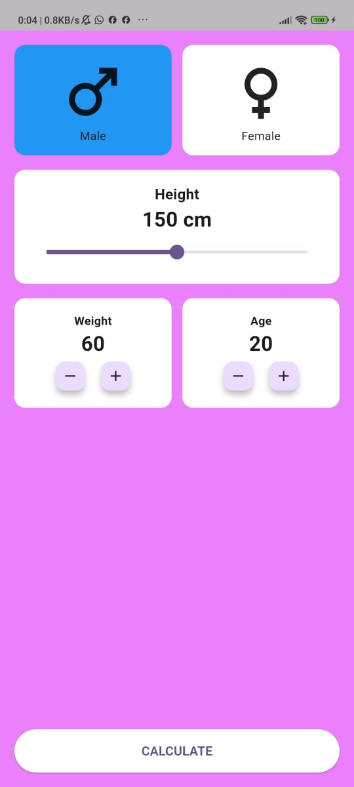

# BMI Calculator

A simple **BMI (Body Mass Index) Calculator** Flutter app.

---

## Android App Release

The **BMI Calculator Android app** is now released! 

You can download the APK and install it on your Android device here:  

[Download APK](https://github.com/visalweerakoon/BMI_Calculator-App/releases)

---

## Features

- Calculate BMI based on height and weight
- Shows BMI count
- Clean and simple UI
- Works on Android devices

---

## Screenshots



---

## Getting Started

### Prerequisites

- Flutter SDK installed: [Flutter Installation](https://flutter.dev/docs/get-started/install)
- Android Studio or VS Code

### Run the App

1. Clone the repository:

```bash
git clone https://github.com/visalweerakoon/BMI_Calculator-App.git
